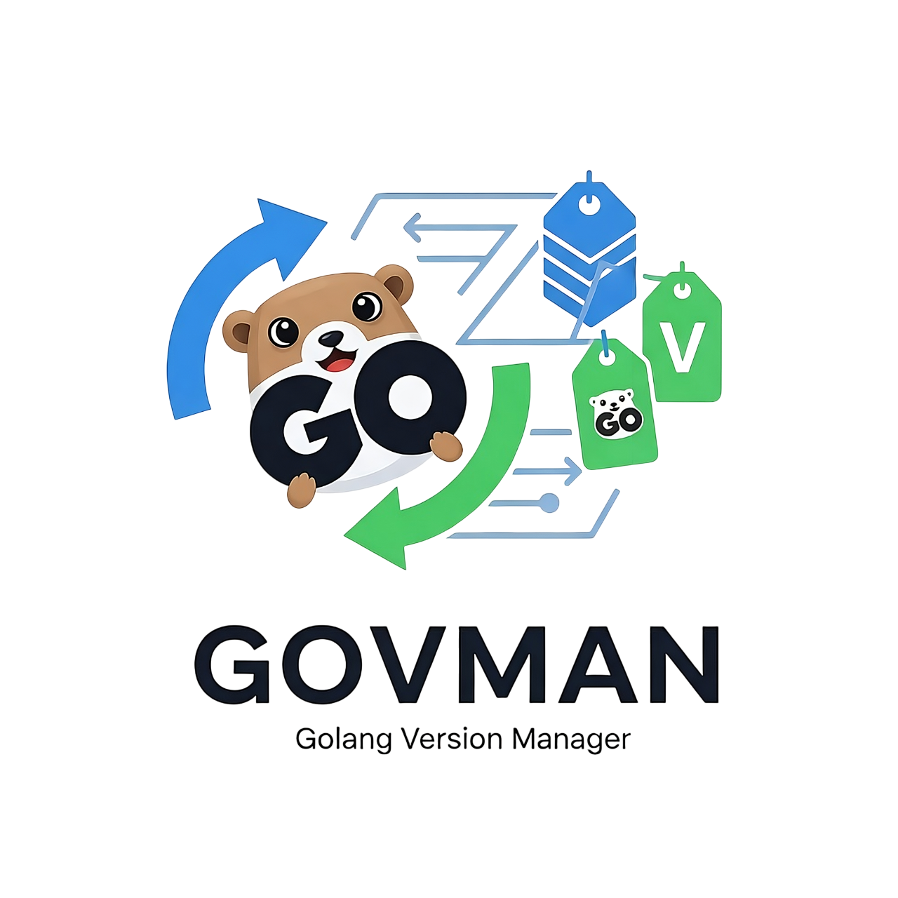

<p align="center">
  
  
  
  
</p>

<p align="center">
  <strong>GOVMAN</strong> is a fast, secure, and powerful Go version manager that simplifies your development workflow. 
  <br><br>
  Effortlessly install, manage, and switch between multiple Go versions with a single command. Perfect for developers working across projects with different Go requirements—from experimenting with cutting-edge releases to maintaining legacy systems.
  <br><br>
  GOVMAN keeps your development environment organized, efficient, and hassle-free.
</p>

---

## ✨ **Features**

| Feature | Description |
|---------|------------|
| **⚡ Lightning Fast** | Optimized for speed with parallel downloads and smart caching |
| **🔒 Secure** | Automatic integrity verification and checksum validation |
| **🔄 Flexible Version Switching** | Session-only, system-wide, or project-specific activation |
| **🤖 Smart Shell Integration** | Automatic PATH management with support for bash, zsh, fish, and PowerShell |
| **📦 Complete Management** | Install, uninstall, list, and clean Go versions |
| **🌐 Cross-Platform** | Works on Linux, macOS, and Windows |
| **🧰 Rich CLI Experience** | Beautiful terminal output with progress indicators and emojis |
| **📡 Remote Version Discovery** | Browse and install from official Go releases |
| **🧹 Disk Optimization** | Clean cache and temporary files to reclaim space |

---

## 📋 **Prerequisites**

Before installing GOVMAN, ensure you have:

- **Operating System**: Linux, macOS, or Windows
- **Shell**: bash, zsh, fish, or PowerShell
- **Internet Connection**: Required for downloading Go versions

---

## 🚀 **Installation**

### 🔹 **Automatic Installation** *(Recommended)*

Using **curl**:
```bash
curl -fsSL https://raw.githubusercontent.com/sijunda/govman/main/scripts/install.sh | bash
```

Using **wget**:
```bash
wget -qO- https://raw.githubusercontent.com/sijunda/govman/main/scripts/install.sh | bash
```

### 🔹 **Manual Installation**

1. Download the latest release from the [**GitHub releases page**](https://github.com/sijunda/govman/releases)
2. Extract the binary to a directory in your PATH
3. Run `govman init` to configure shell integration

### 🔹 **Post-Installation**

After installation, restart your terminal or run:

```bash
source ~/.bashrc  # or ~/.bash_profile, ~/.zshrc, etc.
```

---

## 💻 **Usage**

### 📌 **Basic Commands**

#### **Installation Commands**
```bash
# Install the latest stable Go version
govman install latest

# Install a specific Go version
govman install 1.25.1

# Install multiple versions at once
govman install 1.25.1 1.24.5 1.23.8
```

#### **Version Management**
```bash
# List installed versions
govman list

# List available versions for installation
govman list --remote

# View detailed information about a version
govman info 1.25.1

# Check current active version
govman current
```

#### **Version Switching**
```bash
# Switch to a specific version (session-only)
govman use 1.25.1

# Set a version as system default
govman use 1.25.1 --default

# Set a version for the current project
govman use 1.25.1 --local
```

#### **Maintenance Commands**
```bash
# Uninstall a version
govman uninstall 1.25.1

# Clean download cache
govman clean

# Update govman itself
govman selfupdate
```

### 🎯 **Advanced Usage**

#### **Project-Specific Versions**

Create a `.govman-version` file in your project directory using either method:

**Method 1** - Using govman command:
```bash
govman use 1.25.1 --local
```

**Method 2** - Manual creation:
```bash
echo "1.25.1" > .govman-version
```

> 💡 **Tip**: GOVMAN will automatically switch to this version when you enter the project directory (requires shell integration).

#### **Shell Integration**

Initialize shell integration for automatic version switching:
```bash
govman init
```

This command configures your shell to automatically switch Go versions based on `.govman-version` files.

---

## 🛠️ **Tech Stack**

| Component | Technology |
|-----------|------------|
| **Language** | Go 1.25.1 |
| **Framework** | Cobra CLI Framework |
| **Configuration** | Viper |
| **Build Tool** | Go Modules |
| **Platforms** | Linux, macOS, Windows |

---

## 📁 **Project Structure**

```
govman/
│
├── 📂 cmd/
│   └── 📂 govman/
│       └── 📄 main.go                # Entry point
│
├── 📂 internal/
│   ├── 📂 cli/                       # CLI commands
│   ├── 📂 config/                    # Configuration management
│   ├── 📂 downloader/                # Download functionality
│   ├── 📂 golang/                    # Go releases handling
│   ├── 📂 logger/                    # Logging utilities
│   ├── 📂 manager/                   # Core version management
│   ├── 📂 progress/                  # Progress tracking
│   ├── 📂 shell/                     # Shell integration
│   ├── 📂 symlink/                   # Symlink management
│   ├── 📂 util/                      # Utility functions
│   └── 📂 version/                   # Version information
│
├── 📂 scripts/
│   ├── 📄 install.sh                 # Installation script
│   └── 📄 uninstall.sh               # Uninstallation script
│
├── 📄 go.mod                          # Go modules
└── 📄 go.sum                          # Go dependencies checksums
```

---

## 🔧 **Configuration**

GOVMAN can be configured through `~/.govman/config.yaml`:

```yaml
# Basic Configuration
install_dir: ~/.govman/versions
cache_dir: ~/.govman/cache
default_version: ""
quiet: false
verbose: false

# Download Settings
download:
  parallel: true
  max_connections: 4
  timeout: 300s
  retry_count: 3
  retry_delay: 5s

# Mirror Configuration
mirror:
  enabled: false
  url: https://golang.google.cn/dl/

# Auto-Switch Settings
auto_switch:
  enabled: true
  project_file: .govman-version

# Shell Configuration
shell:
  auto_detect: true
  completion: true

# Go Releases API
go_releases:
  api_url: https://go.dev/dl/?mode=json&include=all
  download_url: https://go.dev/dl/%s
  cache_expiry: 10m0s

# Self-Update Settings
self_update:
  github_api_url: https://api.github.com/repos/sijunda/govman/releases/latest
  github_releases_url: https://api.github.com/repos/sijunda/govman/releases?per_page=1
```

---

## 🧪 **Testing**

Run tests with:
```bash
go test ./...
```

---

## 🤝 **Contributing**

We welcome contributions! Here's how to get started:

1. 🍴 Fork the repository
2. 🌿 Create a feature branch
3. 💻 Commit your changes
4. 📤 Push to the branch
5. 🔄 Create a Pull Request

---

## 📈 **Performance**

GOVMAN is optimized for performance with:

- ⚡ **Parallel downloads** for faster installations
- 💾 **Smart caching** to avoid re-downloading existing archives
- 💿 **Minimal disk footprint** with efficient storage
- 🔄 **Fast version switching** through symbolic links

---

## 🔒 **Security**

- ✅ All downloads are verified with checksums
- 🔐 Secure HTTPS connections for all remote operations
- 📦 No external dependencies beyond standard libraries
- 🔍 Regular security audits of the codebase

---

## ❓ **FAQ / Troubleshooting**

<details>
<summary><strong>Q: How do I uninstall GOVMAN completely?</strong></summary>

Run the uninstall script:
```bash
curl -fsSL https://raw.githubusercontent.com/sijunda/govman/main/scripts/uninstall.sh | bash
```
</details>

<details>
<summary><strong>Q: GOVMAN is not switching versions automatically</strong></summary>

Ensure you've run `govman init` and restarted your terminal. Check that your shell is supported (bash, zsh, fish, PowerShell).
</details>

<details>
<summary><strong>Q: I'm getting permission errors</strong></summary>

Make sure you have write permissions to `~/.govman` directory. You can change the installation directory in the configuration file.
</details>

<details>
<summary><strong>Q: How do I update GOVMAN?</strong></summary>

Use the built-in self-update command:
```bash
govman selfupdate
```
</details>

---

## 📝 **License**

This project is licensed under the **MIT License**. See the [LICENSE.md](LICENSE.md) file for details.

---

## 👥 **Authors/Credits**
**sijunda** - [sijunda](https://github.com/sijunda)

---

<p align="center">
  <sub>Built with ❤️ by the GOVMAN team</sub>
</p>