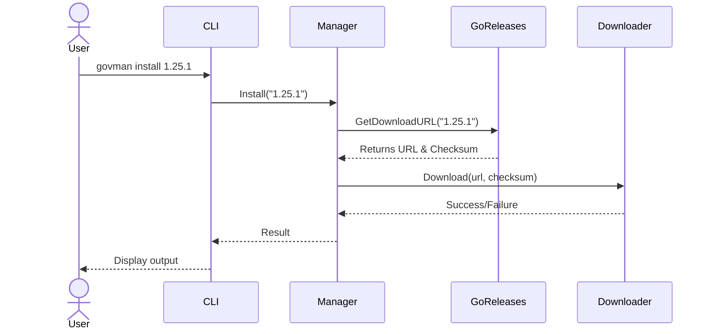
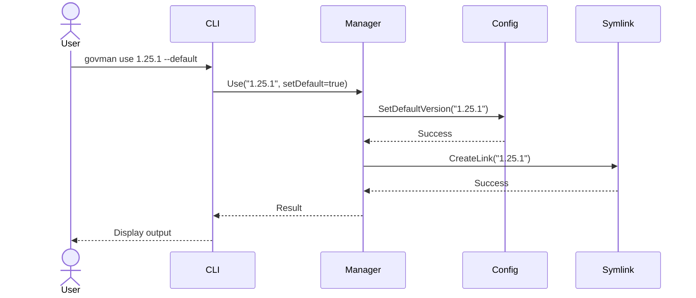
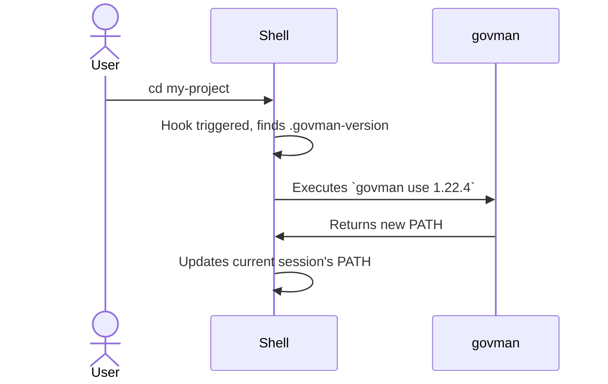

# Architecture Diagrams

This page contains visual diagrams that illustrate the architecture and data flows within `govman`.

## High-Level Component Diagram

This diagram shows the main components of `govman` and their relationships.

```mermaid
graph TD
    subgraph User Interaction
        CLI[CLI Layer<br>(cobra)]
    end

    subgraph Core Logic
        Manager[Manager Layer]
    end

    subgraph Services
        Config[Config<br>(viper)]
        Downloader
        Shell
        GoReleases[Go Releases API]
        Symlink
        Logger
    end

    CLI -->|Executes| Manager

    Manager -->|Uses| Config
    Manager -->|Uses| Downloader
    Manager -->|Uses| Shell
    Manager -->|Uses| GoReleases
    Manager -->|Uses| Symlink
    Manager -->|Uses| Logger

    style CLI fill:#d4e6f1,stroke:#333,stroke-width:2px
    style Manager fill:#d1f2eb,stroke:#333,stroke-width:2px
    style Services fill:#fdebd0,stroke:#333,stroke-width:1px
```

## `install` Command Sequence Diagram

This diagram illustrates the sequence of events when a user runs `govman install <version>`.



## `use` Command Sequence Diagram

This diagram shows the process for activating a Go version with `govman use <version> --default`.



## Auto-Switching Sequence Diagram (on `cd`)

This diagram illustrates how shell integration works when changing directories.

