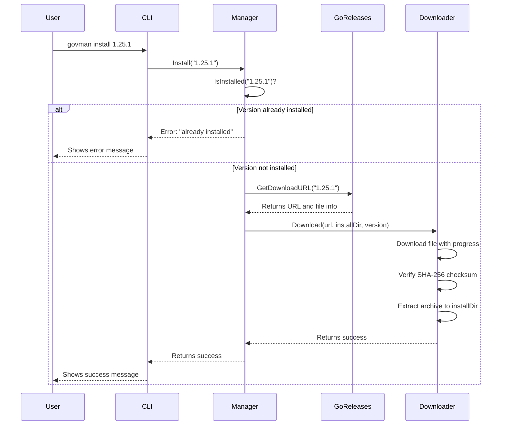
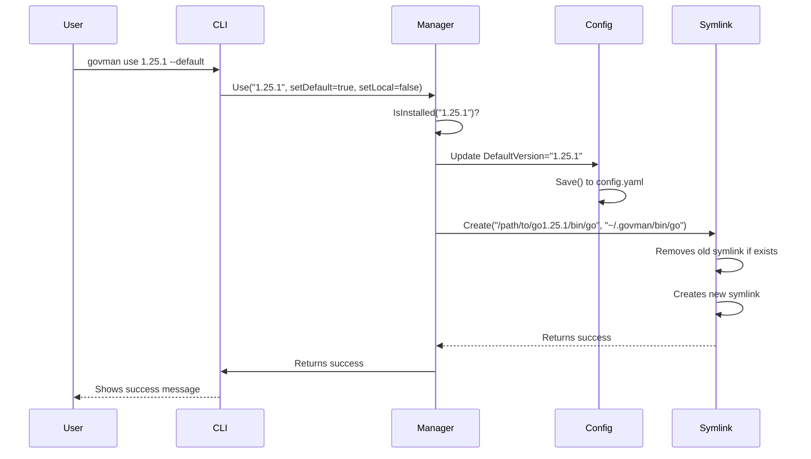
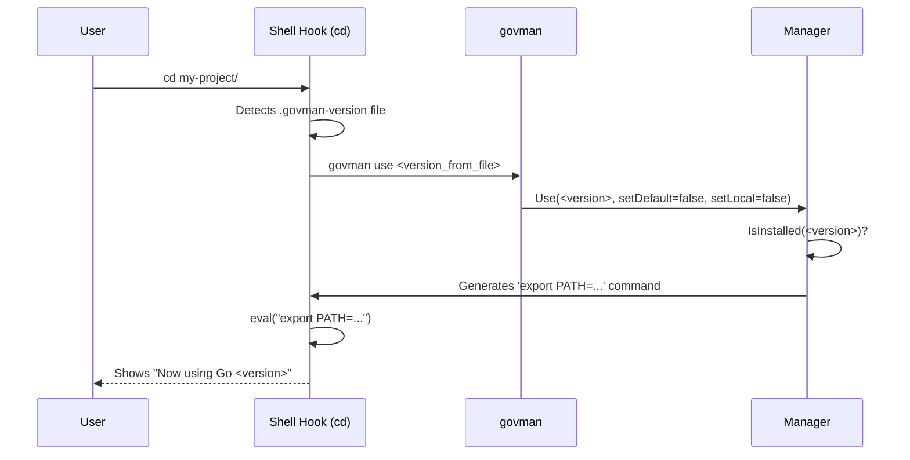

# Data Flow and Sequences

This document illustrates the data flow and sequence of operations for key `govman` functionalities. Understanding these flows is crucial for debugging and extending the application.

## Sequence 1: `govman install 1.25.1`

This sequence describes the process of downloading and installing a specific Go version.

### Key Steps:

1.  **CLI**: Parses the `install` command and the version argument.
2.  **Manager**: Receives the request and first checks if the version is already installed to prevent duplicate work.
3.  **GoReleases**: The manager queries the `golang` package to fetch the correct download URL and checksum for the user's platform (OS/Arch).
4.  **Downloader**: The manager delegates the download and extraction process to the `downloader`. The downloader handles the network request, checksum validation, and archive extraction in a sandboxed directory.
5.  **Filesystem**: The final `go` SDK is placed in `~/.govman/versions/go1.25.1`.

---

## Sequence 2: `govman use 1.25.1 --default`

This sequence shows how `govman` activates a version as the system-wide default.

### Key Steps:

1.  **CLI**: Parses the `use` command, version, and the `--default` flag.
2.  **Manager**: Receives the request and validates that the requested version is installed.
3.  **Config**: The manager updates the `default_version` field in the `config.yaml` file. This ensures that the default is remembered across sessions.
4.  **Symlink**: The manager instructs the `symlink` utility to create a symbolic link from `~/.govman/bin/go` to the actual `go` binary of the target version. This is the core mechanism for global version switching.
5.  **PATH**: The user's shell `PATH` must already include `~/.govman/bin`. When the user opens a new terminal, the shell finds the `go` command via the symlink.

---

## Sequence 3: Automatic Switching with `.govman-version`

This sequence describes how the shell integration automatically switches versions when a user changes directories.

### Key Steps:

1.  **Shell Hook**: The `govman init` command installs a hook on the `cd` command (or `chpwd` in Zsh, `prompt` in PowerShell).
2.  **Detection**: When the user changes directories, the hook checks for the existence of a `.govman-version` file.
3.  **Execution**: If the file is found, the hook reads the version from it and calls `govman use <version>`.
4.  **Manager**: The `use` command runs in `session-only` mode. It doesn't change the default symlink.
5.  **PATH Update**: The manager generates a command to prepend the target version's `bin` directory to the `PATH` (e.g., `export PATH=...`). This command is then `eval`'d by the shell hook, updating the environment for the current session only.